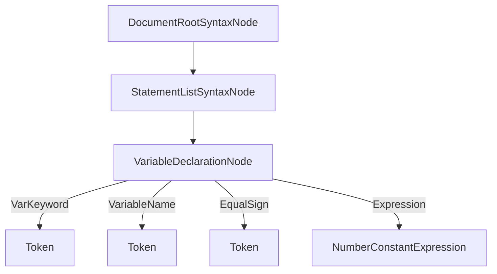

# Syntax Tree Model

The syntax tree model is defined in `Lucy.Core.Model`. It is generated via a source generator from the `model.xml`. Each node can have 0 or more child nodes, either as scalar properties or list properties. Some notable node types are:
- `DocumentRootSyntaxNode`: is the root of a document. Each document starts with this node.
- `StatementSyntaxNode`: The base class for all statements. A statement is a language construct that does not return a value. Example: `var variable = 1`

- `ExpressionSyntaxNode`: The base class for all expressions. A expression is language construct that returns a value. Examples: `1`, `1+1` or `getValue()`

- `TokenNode`: Represent the leaves of the syntax tree. This node contains the actual code as string that was found in the input string. Each token also contains a `TrailingTrivia` property which contains any text after the token that is not relevant to the actual language (like whitespace or comments).

A typical syntax tree:

 

The following features / guarantees are given by the syntax tree model: 

- Each node has a node id which has a generic parameter which represents the type of the node. It also contains the path to the document the node is a part of.

- The deepest node is always a token (`TokenTreeNode`)

- Each syntax tree node has a `GetChildNodes` method. This method returns a list of all child nodes without using reflection an can therefore be used for fast tree traversal.

- Each node is immutable and can therefore never been changed. This makes it possible to cache nodes.

- Nodes do NOT override `Equals`. A node reference is only equal to a other node reference if they point to the same instance (`ReferenceEquals`). A equals check will therefore be very fast but will not take the content of a node into account. The parser will return cached node instances if the input string has not changed. This makes it possible to still compare nodes from a tree against nodes from a previous version of the same tree.

- Nodes do not hold a reference to a parent node. New nodes can be created by reusing existing nodes without the need to change the child nodes.

